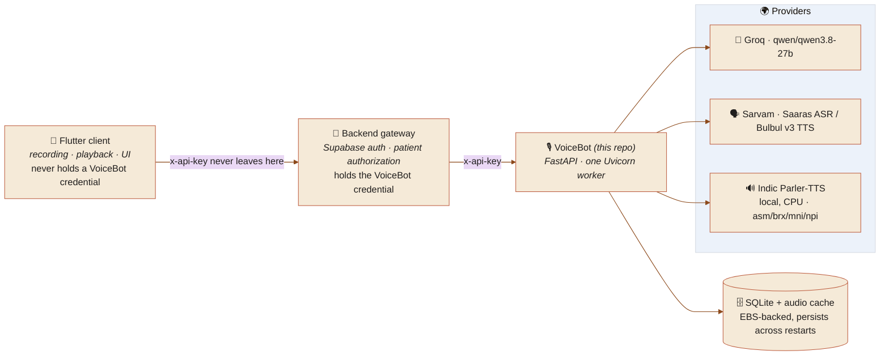
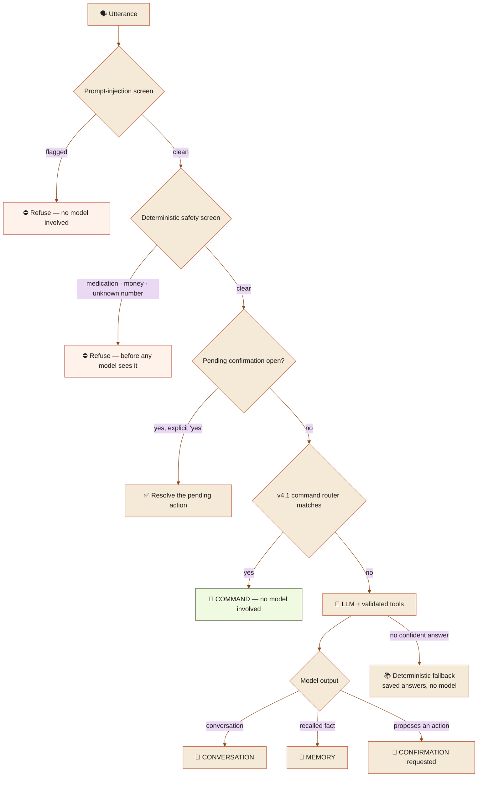
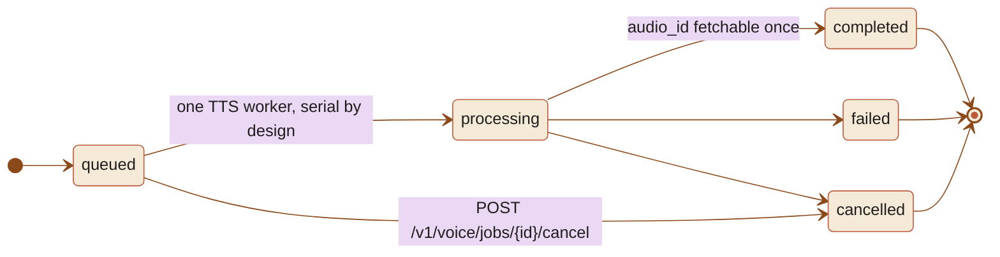
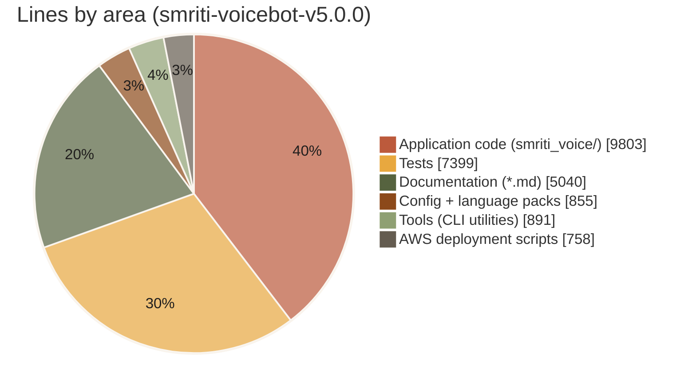

<div align="center">


<br/>

**Project:** SMRITI · **Project ID:** SIH26003YELLOW · **Module:** AI Voice Assistant

<a href="#-the-idea"></a>
<a href="#-languages"></a>
<a href="#-security-model"></a>

<br/>


<br/><br/>

**[The idea](#-the-idea)** ·
**[What it does](#-what-it-does)** ·
**[Architecture](#-architecture)** ·
**[How a turn is decided](#-how-a-turn-is-decided)** ·
**[API](#-api)** ·
**[Security](#-security-model)** ·
**[Languages](#-languages)** ·
**[Getting started](#-getting-started)** ·
**[Project layout](#-project-layout)**

<br/>

🟢 **[Live health](https://15-206-144-216.nip.io/v1/health)** ·
📖 **[Live API docs (Swagger)](https://15-206-144-216.nip.io/docs)** ·
🌐 **[Live language matrix](https://15-206-144-216.nip.io/v1/languages)** ·
📦 **[This repo](https://github.com/harshita10sharma/Smriti-VoiceBot)** ·
🏠 **[SMRITI caregiver web app](https://github.com/Abhayk777/SMRITI)**

</div>


## 🪢 The idea

SMRITI pairs an elderly parent with a tablet that listens, understands, and speaks back
in their own language — no screen-reading, no menus, no remembered commands. VoiceBot is
the part that makes "understands and speaks back" real. It is one FastAPI service with a
narrow job: turn a recorded question into a safe, personal, spoken answer. A separate
Backend owns the account and the family's data, and a separate Flutter client owns the
device — VoiceBot never sees either directly.

v5 is an **extension of v4.1, not a replacement**. The v4.1 command router still runs
first on every turn and still has final authority over actions — see `AUDIT.md` for the
migration record.

<table>
<tr>
<td width="34%" valign="top">

### 👵 For the elder

A question in Assamese, Hindi, or one of thirteen other configured languages gets a
spoken answer in the same language — from personal memory, the daily routine, or an
honest "I don't know," never a guess.

</td>
<td width="33%" valign="top">

### 🔌 For the Backend

One gateway, one contract. VoiceBot holds no Supabase session and authenticates nothing
about the end user — the Backend proxies every call and is the only thing that ever holds
the VoiceBot credential.

</td>
<td width="33%" valign="top">

### 🛟 For the safety-critical asks

Changing medication, moving money, or dialing an unknown number is refused
**deterministically, in code** — before any model ever sees the request. A model can
propose an action; it can never authorise one.

</td>
</tr>
</table>

**Integrating with the Backend or Flutter team?** `INTEGRATION_CONTRACT.md` is the
authoritative behavioral/ownership contract. For the practical walkthrough, start with
[`docs/VOICEBOT_INTEGRATION_GUIDE.md`](docs/VOICEBOT_INTEGRATION_GUIDE.md) — verified
against this codebase's actual behavior and the live deployment below.


## ✨ What it does

|     | Capability                    | What it actually does                                                                                                       |
| :-: | ------------------------------ | ----------------------------------------------------------------------------------------------------------------------------- |
| 💬  | **Text conversation**         | `POST /v1/conversation` — a turn in, a personalised reply out, session-aware                                                  |
| 🎙  | **Voice conversation**        | `POST /v1/conversation/voice` — spoken audio in, an async TTS job and a fetchable audio reply out                            |
| 🧠  | **Personal memory**           | Family, medicines and routine answered from a synced snapshot of the caregiver's data — never invented                       |
| 🛡  | **Deterministic safety**      | A prompt-injection screen and a hard-coded refusal list run **before** any model sees the utterance                          |
| 🧭  | **v4.1 command router**       | Still first in line on every turn, still has final authority over actions — v5 extends it, doesn't replace it                |
| 🧰  | **Validated tool calls**      | The model can propose a tool call; only the registry can execute one, and only after validation                              |
| 🗣  | **15 configured languages**   | ASR / LLM / TTS / offline-fallback capability reported per language, independently of each other                             |
| 📡  | **Offline fallback**          | With no network and no local LLM: family lookup, routine, medicine times, reminders and commands still work                  |
| 🔄  | **Memory sync**               | `POST /v1/memory/sync` — a revisioned, transactional snapshot replace; stale and conflicting revisions are rejected, not applied |
| 🧾  | **Legacy compatibility**      | `POST /v1/command` — the original v4.1 endpoint, kept for backward compatibility                                              |


## 🏛 Architecture

VoiceBot has **no end-user auth of its own and no Supabase session**. It sits behind the
Backend, which is the only party that ever holds its credential.



VoiceBot owns: ASR, conversation routing, personal memory, deterministic safety,
prompt-injection handling, action proposal/validation/confirmation, TTS, voice jobs,
temporary audio, language capability reporting, and its own API/deployment security. It
does not authenticate end users, does not talk to Supabase, and does not know about
Flutter. Full split in
[Ownership](docs/VOICEBOT_INTEGRATION_GUIDE.md#3-ownership).


## 🧭 How a turn is decided



The model can **propose**. Only the safety layer, the command router and the tool
registry can **authorise** — a model output never reaches a database write, the phone
dialer, or a medication change directly. Full detail in `ARCHITECTURE.md` and
`SECURITY.md`.

### 🗣 Voice job lifecycle

`POST /v1/conversation/voice` returns an immediate text response and, if there's
something to say, a `job_id` to poll.



Audio is never embedded in a JSON body or written to a log — a voice response carries an
opaque `audio_id`, and the client fetches the bytes once (ids expire, default 15 min).


## 🔌 API

| Method | Path                              | Auth   | Purpose                                                                                  |
| ------ | ---------------------------------- | ------ | ------------------------------------------------------------------------------------------ |
| `GET`  | `/v1/health`                      | public | Capability and connectivity report. Never returns a key.                                  |
| `GET`  | `/v1/languages`                   | public | The full capability matrix.                                                               |
| `GET`  | `/v1/languages/{code}`            | public | One language's capabilities.                                                              |
| `POST` | `/v1/conversation`                | key    | Text turn. `{user_id, message, session_id?, language?}`                                   |
| `POST` | `/v1/conversation/welcome`        | key    | Session-opening greeting.                                                                 |
| `POST` | `/v1/conversation/voice`          | key    | Voice turn. Multipart `audio_wav`, `user_id`, `session_id?`, `language?`, `speak?`        |
| `GET`  | `/v1/voice/jobs/{job_id}`         | key    | Poll an asynchronous voice-synthesis job.                                                 |
| `POST` | `/v1/voice/jobs/{job_id}/cancel`  | key    | Cancel a queued/processing job.                                                            |
| `GET`  | `/v1/audio/{id}`                  | key    | Fetch generated speech once. Ids expire (default 15 min).                                 |
| `POST` | `/v1/memory/sync`                 | key    | Full-snapshot caregiver-memory synchronization.                                            |
| `GET`  | `/v1/tools`                       | key    | Tool registry introspection.                                                              |
| `POST` | `/v1/command`                     | key    | **Legacy v4.1 endpoint** — kept for compatibility; new integrations should use the above.  |

See `docs/API_INTEGRATION.md` / `docs/integration/openapi.json` for full request/response
schemas.

> [!IMPORTANT]
> **Authentication fails closed.** Every personal-data endpoint requires `x-api-key`
> (never `Authorization: Bearer`) — the credential is server-side only and must never
> reach Flutter or a browser. Missing personal-endpoint configuration returns `503`, not
> open access. See [Security model](#-security-model).


## ☁️ Current live deployment

|                        |                                                                       |
| ---------------------- | ----------------------------------------------------------------------- |
| Base URL               | `https://15-206-144-216.nip.io`                                       |
| Region                 | AWS `ap-south-1`                                                       |
| Compute                | EC2 `m7i-flex.large`, Docker, one Uvicorn worker                       |
| Storage                | Persistent 30 GB EBS at `/data` (database, audio cache, model cache)   |
| HTTPS                  | Caddy, real Let's Encrypt certificate, survives reboot                 |
| Current live identity  | `elder-1` (single pilot identity — `elder-2`/`elder-3` are not active) |

See `docs/AWS_DEPLOYMENT.md` for the full architecture and `deployment/aws/` for the
provisioning/deploy/backup tooling.

| Role         | Provider                                          | Notes                                                                      |
| ------------ | ---------------------------------------------------- | ------------------------------------------------------------------------------ |
| General LLM  | Groq, `qwen/qwen3.8-27b`                            | `SMRITI_LLM_PROVIDER=groq`; real calls verified live                          |
| Cloud ASR    | Sarvam (Saaras family)                              | Real calls verified live against the deployment above                        |
| Cloud TTS    | Sarvam Bulbul v3                                    | Real calls verified live                                                     |
| Local TTS    | Indic Parler-TTS (`ai4bharat/indic-parler-tts`)     | asm/brx/mni/npi; real synthesis verified live, CPU, ~20–27s per short utterance |

Gemini, OpenAI and local-LLM interfaces remain available where explicitly configured but
are not the deployed path.


## 🔐 Security model

Authentication fails closed and the model is never trusted to authorise anything by
itself, so the codebase treats every rule below as a hard requirement.

|  #  | Rule                                                                                                                             |
| :-: | ----------------------------------------------------------------------------------------------------------------------------------- |
|  1  | Every personal-data endpoint requires `x-api-key`; missing configuration returns `503`, never open access                          |
|  2  | `SMRITI_AUTH_USER_ID` is a **dev/staging fixture only** — silently ignored whenever `SMRITI_API_KEYS` is set                       |
|  3  | `SMRITI_API_KEYS` is the production mechanism: a fixed patient list per key, or a dynamic key whose patients grow via its own sync calls |
|  4  | The model can **propose** a tool call; only the registry can **execute** one, and only after validation                            |
|  5  | `action_accepted: true` means the deterministic layer authorised the action — **not proof of a real side effect**                  |
|  6  | No real calling or reminder-scheduling executor exists in this repository by design — both are contract-ready, not wired to a phone |
|  7  | Audio is never embedded in a JSON body or written to a log                                                                          |
|  8  | Generated-audio ids expire (default 15 min) and are fetchable once                                                                  |
|  9  | One Uvicorn worker, by design — `SessionStore`, the rate limiter and the Indic Parler-TTS model instance are all process-local      |
| 10  | Sessions, pending confirmations and history are SQLite-persisted and survive a restart                                             |
| 11  | A prompt-injection screen and a hard-coded safety refusal list run **before** any model sees the utterance                          |
| 12  | `SMRITI_ALLOW_UNAUTHENTICATED=1` only relaxes the key check for local development                                                  |

Full threat model and red-team results in `SECURITY.md`.

### Memory synchronization

VoiceBot's personal memory is a **synchronized copy, not the source of truth** —
Supabase remains authoritative. `POST /v1/memory/sync` replaces a patient's
family/medicine/routine records as a full, transactional snapshot, keyed by an optional
`source_revision`: an older revision is rejected, an identical replay is a harmless
no-op, and a same-revision sync with different content is rejected as a conflict. See
[Memory synchronization](docs/VOICEBOT_INTEGRATION_GUIDE.md#7-memory-synchronization).


## 🌏 Languages

All 15 configured languages, straight from the generated
`docs/integration/language_matrix.json` — ✅ where a provider is genuinely wired up and
callable today, a dash where it isn't yet:

| Code    | Language               | ASR online | ASR offline | LLM | TTS | Native-speaker validated |
| ------- | ----------------------- | :--------: | :---------: | :-: | :-: | :------------------------: |
| `hin`   | Hindi                   | ✅         | ✅          | ✅  | ✅  | –                          |
| `ben`   | Bengali                 | ✅         | ✅          | ✅  | ✅  | –                          |
| `eng`   | English                 | ✅         | –           | ✅  | ✅  | –                          |
| `asm`   | Assamese                | ✅         | –           | ✅  | ✅  | –                          |
| `npi`   | Nepali                  | ✅         | ✅          | ✅  | ✅  | –                          |
| `brx`   | Bodo                    | ✅         | ✅          | –   | ✅  | –                          |
| `mni`   | Meitei (Manipuri)       | ✅         | ✅          | –   | ✅  | –                          |
| `ccp`   | Chakma                  | –          | –           | –   | –   | –                          |
| `grt`   | Garo                    | –          | –           | –   | –   | –                          |
| `kha`   | Khasi                   | –          | –           | –   | –   | –                          |
| `lus`   | Mizo                    | –          | –           | –   | –   | –                          |
| `nag`   | Nagamese                | –          | –           | –   | –   | –                          |
| `trp`   | Kokborok (Tripuri)      | –          | –           | –   | –   | –                          |
| `wao`   | Wancho                  | –          | –           | –   | –   | –                          |
| `nyish` | Nyishi                  | –          | –           | –   | –   | –                          |

TTS for `asm`/`brx`/`mni`/`npi` is **local Indic Parler-TTS** — Sarvam Bulbul's voice list
doesn't reach these four, so local synthesis is the real path, and it's been exercised
live against the deployment above. The other 8 languages have detection support and, for
most, a benchmark-stage local ASR model not yet promoted to production — see
`LANGUAGE_SUPPORT.md` for the full matrix and what it would take to bring one online.
Native-speaker validation (WER/CER measured on real speech) is the next milestone for
every configured language, not yet recorded for any of them — see `EVALUATION.md` for
the plan. `mni` is Meiteilon/Manipuri and is never mapped to Mongolian (`mn`).


## 📊 By the numbers

<table>
<tr>
<td width="55%">



</td>
<td width="45%" valign="top">

|                          |                    |
| -------------------------- | -------------------: |
| 🧪 Test functions          |             **478** |
| ✅ Full suite result        |     **655 passed** |
| 🔌 API endpoints           |              **11** |
| 🌐 Configured languages    |              **15** |
| 🧰 Registered tools        |              **21** |
| 📚 Reference documents     |             **20+** |

Every test in this repository's own suite is **mocked/deterministic** — none makes a live
provider call. Real-provider verification (Groq, Sarvam ASR/TTS, Indic Parler-TTS,
voice jobs, memory sync, patient isolation, restart/reboot recovery) has been performed
separately against the live AWS deployment above. See `EVALUATION.md` and
`docs/RELEASE_ACCEPTANCE.md` for the evidence-cited breakdown.

</td>
</tr>
</table>

**Overall status: ready for Backend integration.** Cross-system integration (a real
Backend gateway, a real Flutter client) and physical-device acceptance remain pending —
see `docs/RELEASE_ACCEPTANCE.md`. **Native-speaker language quality validation has not
been performed for any language.**


## 🚀 Getting started

```bash
git clone https://github.com/harshita10sharma/Smriti-VoiceBot.git
cd smriti-voicebot-v5.0.0
python -m venv .venv
source .venv/bin/activate          # Windows: .venv\Scripts\activate
pip install -r requirements.txt

cp .env.example .env               # set SMRITI_API_KEY and SMRITI_AUTH_USER_ID
python main.py --test-config       # checks configuration, contacts nothing
pytest -q
```

<details>
<summary><b>▶️ Running locally</b></summary>

<br/>

```bash
python main.py --health                 # capability report
python main.py --list-languages         # v4.1 language packs
python main.py --seed-demo              # create the demo elder in SQLite
python main.py --chat                   # interactive text chat

uvicorn smriti_voice.api.app:app --host 0.0.0.0 --port 8000
python tools/smoke_test.py --base-url https://15-206-144-216.nip.io   # against the live deployment
```

</details>

<details>
<summary><b>🧪 Testing and verification</b></summary>

<br/>

```bash
pytest -q                      # full test suite: 655 passed
pytest tests/safety -q         # safety and red-team assertions
python -m compileall -q .
```

</details>

<details>
<summary><b>☁️ Deploy to AWS</b></summary>

<br/>

`deployment/aws/provision.sh` → `deployment/aws/first_boot_setup.sh` (on the instance) →
build the image → `deployment/aws/deploy.sh` → `deployment/aws/smoke_test.sh`. Full plan,
sizing rationale and cost estimate in `docs/AWS_DEPLOYMENT.md`.

</details>


## 🗂 Project layout

```text
smriti-voicebot-v5.0.0/
├── main.py                      CLI entry point (--health, --chat, --seed-demo, --test-config)
├── smriti_voice/
│   ├── api/                     FastAPI app, routes, dependencies (app.py, dependencies.py)
│   ├── conversation/             turn routing, context, confirmation state
│   ├── language/                 registry + capability matrix (registry.py, capabilities.py)
│   ├── memory/                   personal memory + sync (seed.py, snapshot handling)
│   ├── offline/                  offline fallback answers, health reporting
│   ├── database/                 SQLite connection + persistence
│   ├── voice_jobs.py              async TTS job lifecycle
│   └── config.py                 environment-driven configuration
├── config/                       language_validation.json and friends
├── language_packs/               per-language content
├── deployment/aws/                provision · first_boot_setup · deploy · smoke_test · rollback
├── docs/
│   ├── VOICEBOT_INTEGRATION_GUIDE.md   master integration reference — start here
│   ├── BACKEND_VOICEBOT_INTEGRATION.md  step-by-step for the Backend developer
│   ├── FLUTTER_VOICEBOT_INTEGRATION.md  step-by-step for the Flutter developer
│   ├── AWS_DEPLOYMENT.md                current, live AWS deployment
│   └── integration/                     OpenAPI, memory/action schemas, language matrix, error catalog
├── tools/                        smoke_test.py, generate_language_matrix.py, validate_config.py, backup_db.py
└── tests/                        unit · integration · multilingual · safety
```

<details>
<summary><b>📚 Reference documents</b></summary>

<br/>

| File                                       | Contents                                                                          |
| -------------------------------------------- | ------------------------------------------------------------------------------------ |
| `AUDIT.md`                                 | The pre-migration audit of v4.1 and what happened to each module                 |
| `ARCHITECTURE.md`                          | Subsystems, turn flow, provider abstractions                                     |
| `SECURITY.md`                              | Threat model, red-team results, what is enforced where                           |
| `LANGUAGE_SUPPORT.md`                      | Generated capability matrix — configured vs. speakable vs. validated             |
| `EVALUATION.md`                            | What was tested, what was mocked, what was live, what was not tested             |
| `HANDOFF.md`                               | Practical integration handoff for the Backend/Flutter teams                      |
| `INTEGRATION_CONTRACT.md`                  | The detailed API/ownership contract                                              |
| `STAGING_READINESS.md`                     | What is actually demonstrated for pilot/staging, with evidence                   |
| `CODEBASE_STATUS.md`                       | Component-by-component implementation status, dated                             |
| `PROVISIONING_DESIGN.md`                   | Current pilot provisioning vs. a future scalable design (not implemented)        |
| `CHANGELOG.md`                             | Notable changes, grouped by theme and dated from git history                     |
| `docs/RELEASE_ACCEPTANCE.md`               | Evidence-based acceptance matrix for every requirement                           |
| `docs/integration/CONTRACT_ACCEPTANCE_MATRIX.md` | All 19 integration-contract sections mapped to owner and status            |
| `docs/AZURE_DEPLOYMENT.md`                 | Historical — Azure was evaluated before the target moved to AWS                  |

</details>


<div align="center">


**SMRITI VoiceBot** · _the voice on the other end, in their own language._

<sub>An independent FastAPI service, deployed and reachable on its own — see <a href="#-current-live-deployment">live deployment</a>. It plugs into the wider SMRITI product (<a href="https://github.com/Abhayk777/SMRITI">caregiver web app ↗</a>) as one module, but ships, runs and is tested standalone.</sub>

<br/><br/>

<sub>Specs live in <code>docs/</code> · the authoritative contract is <a href="INTEGRATION_CONTRACT.md"><code>INTEGRATION_CONTRACT.md</code></a> · start integrating at <a href="docs/VOICEBOT_INTEGRATION_GUIDE.md"><code>docs/VOICEBOT_INTEGRATION_GUIDE.md</code></a></sub>

</div>
